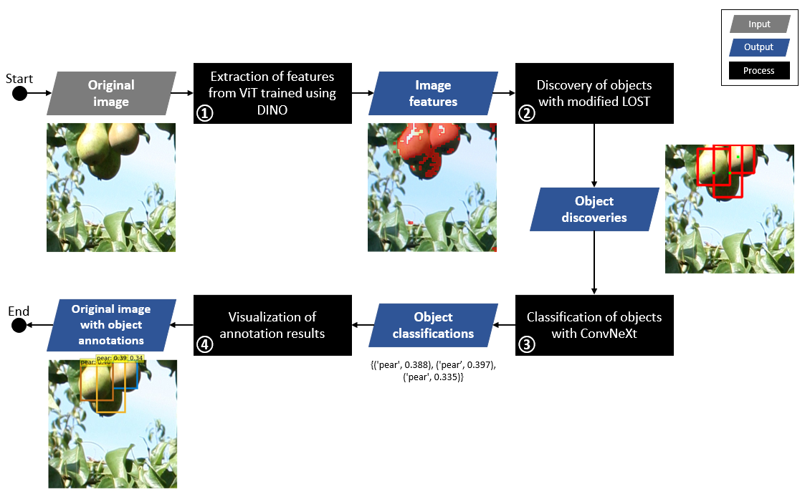

# auto-annotate-DL

## How to automatically annotate objects in images?

Deep Learning (DL) is an area of Machine Learning where algorithms are modeled to imitate human rationale. Among DL's most important application areas are computer vision and natural language processing, impacting our everyday life when we access our phone through facial recognition authorization, interact with a company's chatbot, or get support from a virtual assistant like Alexa.

Unfortunately, DL requires large supplies of data to optimize massive models of parameters that are at the core of these algorithms. Given the impossibility of having large labeled and diverse datasets for myriad applications, training DL models can be seen as a task only doable by big technology players. Nevertheless, this is a misconception as precisely generic models trained by these players, that are made publicly available, can be directly transferred as a knowledge source to target applications where there is insufficient data. 

Thus, this focuses on enabling a DL automatic annotation application that does not require model training by relying on the latest advances in self-supervised learning (DINO), vision transformers (ViT), and convolutionals (ConvNeXt). This code is based on my Ph.D. work, where I propose data generation and model training strategies to overcome the limitation of insufficient data in non-conventional computer vision applications for agriculture. The provided annotation results are noisy, as objects are not perfectly located or classified. Still, they can be used as a baseline to automatically generate a dataset for a target application. This is especially advantageous since the manual generation of a dataset is labor-intensive and time-consuming.

The application can be run from [object_detector.ipynb] (https://github.com/mariaculman18/auto-annotate-DL/blob/main/object_detector.ipynb) or [object_detector.py] (https://github.com/mariaculman18/auto-annotate-DL/blob/main/object_detector.py).

In short:
* What? Annotating objects in images without model training.
* Input: images containing single or multiple objects. Objects from [ImageNet-21 thousand classes](https://storage.googleapis.com/bit_models/imagenet21k_wordnet_lemmas.txt) can be recognized.
* Output: images with boxes containing objects. Each annotation displays the most probable class of the object and the confidence (0-1) the model gives to the inference.

How does it work?

Following the below flowchart:
1. The original image is fed into a powerful feature extractor to obtain segmenting features. The feature extractor is a Vision Transformer (ViT) trained under a self-supervised method called [DINO](https://arxiv.org/abs/2104.14294) and developed at Facebook.
2. An object discovery algorithm uses those features to locate potential objects in the image. The algorithm is a modified version of Localizing Objects with Self-Supervised Transformers and no Labels [LOST](https://arxiv.org/abs/2109.14279) that allow locating multiple object instances.
3. The object discoveries are fed into an image classifier to obtain the most probable class it belongs to (highest confidence). This robust classifier, [ConvNeXt](https://arxiv.org/abs/2201.03545), was trained with objects from more than 21 thousand different classes.
4. Resulting object annotations (discoveries + classes) are displayed in the original image accompanied by the confidence score.

Install the necessary packages to run the code in a conda environment:

    conda create -n object_det_env
    source activate object_det_env
    conda install pytorch torchvision torchaudio cpuonly -c pytorch
    conda install -c conda-forge opencv matplotlib tqdm scikit-image
    pip install opencv-python-headless
    pip install gradio
    (If using the Jupyter notebook version)
    conda install -c conda-forge ipykernel ipywidgets
    python -m ipykernel install --user --name object_det_env --display-name "Python (object_det_env)"

Instructions to see the code in action:
1. Place images in the images folder. Images should be in JPEG format (extension *.jpg). 
2. Run the code. If running from the Python version, see in the terminal the name of the image and the annotation results of classes and confidences. And if running from the Jupyter Notebook version see these data besides the images with objects located, classified, and the attributed confidence.
3. Check the output folder to see the resulting images.

Notes:
* Modify the potential number and extent of the discovered objects by changing the parameters: number_seeds and correlation_th.
* Image examples from my personal files and [ImageNet](https://www.image-net.org/), a generic dataset, have been placed for demonstration purposes. These are fruits but the code is extensible to any image.
* An auxiliary python file is placed for building the feature extractor (vision_transformer.py), this was taken from [DINO repository](https://github.com/facebookresearch/dino). Other resources have been taken from [LOST](https://github.com/valeoai/LOST) and [ConveNeXt](https://github.com/facebookresearch/ConvNeXt) repositories.
